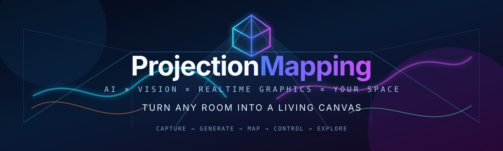

<p align="center">
  
</p>

# ProjectionMapping

A research playground for **projection mapping, spatial augmented reality, projector-camera calibration, learned appearance compensation, realtime generative vision, and interactive AI art**.

The projector is treated as a spatial output device, the camera as feedback, and generative models as one layer in a realtime graphics/control system.

> **Project tracking:** [`ROADMAP.md`](ROADMAP.md) is the canonical roadmap and progress tracker. It preserves the core M0–M6 plan and tracks all extension goals (audio-latent control, dynamic mapping, multi-projector work, advanced neural spatial methods, performance/evaluation, etc.).

## Supported platforms

The portable core targets **Windows, Linux, and macOS**. Capability-specific backends remain explicit:

- Windows: portable core + NVIDIA CUDA/TensorRT + Spout
- Linux: portable core + NVIDIA CUDA/TensorRT; direct fullscreen today, additional transport backends planned
- macOS: portable core + fullscreen/calibration/Room Skin; CUDA/TensorRT unavailable, Syphon is the planned native shared-texture direction

See [`docs/PLATFORMS.md`](docs/PLATFORMS.md) for the compatibility matrix and shell-specific setup instructions. The console marks unsupported features instead of attempting to launch them.

## Python version

**Python 3.12 is the recommended runtime for the main application.** The repository includes `.python-version` set to `3.12` for tools such as pyenv and compatible environment managers.

The package remains compatible with Python **3.10–3.13**. Python 3.10 uses the conditional `tomli` compatibility dependency because standard-library `tomllib` starts at Python 3.11.

For CUDA/StreamDiffusion/TensorRT, prefer Python 3.12 when the selected upstream stack supports it. If a specific ML dependency requires another version, isolate that inference backend in its own environment/process rather than downgrading the control/calibration application.

## Target setup

- **Python 3.12 recommended**
- USB webcam / capture camera
- Home projector connected as another display
- Optional NVIDIA RTX-class GPU for CUDA generative paths
- Optional TouchDesigner / MadMapper
- Optional StreamDiffusion / TensorRT on Windows/Linux NVIDIA systems
- Optional Spout2 GPU texture sharing on Windows

## Operator workflow

The preferred way to use the project is the interactive console.

### Windows PowerShell

```powershell
py -3.12 -m venv .venv
.\.venv\Scripts\Activate.ps1
python -m pip install --upgrade pip
python -m pip install -e ".[ui,vision,dev]"
python -m projection_mapping.web_ui
```

### Windows cmd.exe

```bat
py -3.12 -m venv .venv
.venv\Scripts\activate.bat
python -m pip install --upgrade pip
python -m pip install -e ".[ui,vision,dev]"
python -m projection_mapping.web_ui
```

### Linux / macOS

```bash
python3.12 -m venv .venv
source .venv/bin/activate
python -m pip install --upgrade pip
python -m pip install -e '.[ui,vision,dev]'
python -m projection_mapping.tui
```

If your distro does not expose `python3.12` directly, use pyenv/uv/conda to create a 3.12 environment, then use `python` inside it.

After installation, the shorter entry point opens the browser control deck:

```text
projection-ui
```

The older Textual interface remains available as a lightweight fallback with
`projection-tui` or `python -m projection_mapping.tui`.

The loop is:

```text
browser control deck
  -> choose an effect / experiment
  -> change its parameters
  -> LAUNCH FULLSCREEN
  -> projector shows it
  -> ESC
  -> back to the console
  -> mutate settings / switch mapping / launch again
```

The local control server stays alive while each visual runs as an isolated child process. If the projector window has focus, `Esc` exits that visual normally. The browser's **Stop visual** button terminates the complete child tree. Run logs are captured under `~/.projection_mapping/` and streamed incrementally without rereading the whole file.

Known palette controls include an inline color-ramp preview. The Strange Attractor Lab adds six projector-tuned palettes and `comet`, `pulse_train`, and `full` trajectory animation modes, so its internal motion remains visible even when the camera orbit is subtle.

For spatial setup, launch **Surface Mapper / Corner Pin**. It maps the built-in animated calibration plate—or an image/video—onto multiple draggable quadrilateral surfaces, applies polygon masks and edge feathering, and autosaves normalized geometry to `calibration_data/surface_map.json`. Press `G` to hide the editor guides for clean output.

After saving a profile, **GPU-Mapped Shader Scene** plays Shader Scene Lab content through that geometry without framebuffer readback: scene rendering, homography, masking, feathering and native fullscreen presentation remain in one OpenGL context. This path uses real GLFW monitor indices and preserves F11/ESC behavior.

The UI is **registry-driven** by [`configs/features.toml`](configs/features.toml): new effects declare their command, supported OSs, and typed parameters there, and both browser and Textual control decks render their controls automatically. Registry commands use a portable `python` token that is replaced with the exact active interpreter, avoiding virtualenv/conda/path mismatches across OSs.

See [`docs/CONSOLE_UI.md`](docs/CONSOLE_UI.md) for the full operator and extension guide.

## Architecture

```text
camera / audio / controls
        |
        v
 perception + calibration
 depth / masks / optical flow
        |
        v
 async generative inference
 diffusion / video models
        |
        v
 realtime procedural graphics
 shaders / particles / feedback
        |
        v
 compensation + spatial warp
        |
        v
 fullscreen / platform transport -> compositor -> projector
        |
        v
 physical room -> camera feedback
```

The intended runtime is hybrid: the projector/display loop stays responsive at display refresh while expensive generative inference runs asynchronously with **latest-frame-wins** semantics.

## Current milestone status

- **M0 — photons:** ✅ core path implemented
- **M1 — camera/projector calibration:** 🟡 structured-light and radiometric foundations implemented; real hardware capture/validation pending
- **M2 — realtime GPU transport:** 🟡 Spout/runtime scaffolding implemented; Windows zero-copy validation pending; Linux/macOS transport backends remain roadmap items
- **M3 — neural mirror:** 🟡 perception + concrete async StreamDiffusion path implemented; RTX 4080 hardware benchmark pending
- **M4 — spatially locked generation:** 🟡 first Room Skin prototype implemented; calibrated/AI-driven version pending
- **M5 — closed-loop compensation:** 🟡 inverse/optimization scaffolding and dataset capture implemented; real projector-camera dataset pending
- **M6 — semantic room:** ⬜ planned

See [`ROADMAP.md`](ROADMAP.md) for detailed deliverables, exit criteria, extension milestones M7–M10, and the current priority queue.

## Implemented foundations

- fullscreen projector test-pattern player
- responsive browser operator deck (`projection-ui`) with Textual fallback (`projection-tui`)
- typed, extensible, platform-aware feature registry (`configs/features.toml`)
- cross-platform child-process lifecycle management with ESC-to-return workflow
- per-run log capture under `.projection_mapping/`
- grids, checkerboards, color ramps, Gray-code and phase-shift structured-light patterns
- camera capture helpers
- homography estimation and image warping
- Gray-code decoding for dense projector coordinates
- calibration bundle capture
- radiometry dataset acquisition
- per-channel radiometric LUT estimation
- PyTorch appearance-compensation MLP
- Farneback optical flow and foreground masks
- concrete asynchronous StreamDiffusion integration path
- latest-frame-wins worker and runtime telemetry
- StreamDiffusion benchmark harness
- first spatially locked Room Skin prototype
- modular realtime runtime loop
- OpenCV fullscreen sink
- Spout adapter interface + diagnostics on Windows
- reaction-diffusion GLSL shader starter
- perceptual closed-loop objective scaffolding
- tests for patterns, Gray-code, geometry, LUTs, runtime plumbing, async runtime, and feature registry

## CLI quick start

The lower-level CLI remains useful for scripting and debugging. These commands are portable after installation:

```text
python -m projection_mapping.cli patterns --kind grid --display 1
python -m projection_mapping.cli patterns --kind graycode --display 1 --hold-ms 250
python -m projection_mapping.cli camera --device 0
```

## Optional realtime diffusion

Keep StreamDiffusion outside the core dependency set because its CUDA/TensorRT pins move quickly. On supported Windows/Linux NVIDIA systems:

```text
python -m pip install "streamdiffusion[tensorrt,controlnet,ipadapter] @ git+https://github.com/daydreamlive/StreamDiffusion.git@main"
python -m streamdiffusion.tools.install-tensorrt
```

> Recent pip versions reject the older `#egg=streamdiffusion[...]` extras syntax with `invalid-egg-fragment`. Use the PEP 508 direct-URL form above instead. If the first command fails, do not run the TensorRT installer yet because the `streamdiffusion` module will not exist.

On Windows, Spout is the preferred same-machine GPU-sharing path into TouchDesigner/MadMapper. Linux currently uses direct fullscreen for the portable path while additional transport options are explored. macOS keeps the portable renderer/calibration path and will gain a native Syphon backend separately.

## Ongoing research watch

A monthly research sweep tracks new projection-mapping, spatial-AR, realtime-generative, projector-camera, neural-rendering, and interactive-media projects. Mature, compatible open-source work may be prototyped automatically; risky/unclear/large integrations are added to the roadmap as research candidates instead.

See [`docs/RESEARCH_WATCH.md`](docs/RESEARCH_WATCH.md) for the curation and auto-integration policy.

## Docs

- [`ROADMAP.md`](ROADMAP.md) — canonical milestones, progress, priorities, and extension goals
- [`docs/CONSOLE_UI.md`](docs/CONSOLE_UI.md) — operator console, ESC/fullscreen lifecycle, feature registry, and extension format
- [`docs/PLATFORMS.md`](docs/PLATFORMS.md) — Windows/Linux/macOS support matrix and setup commands
- [`docs/RESEARCH_WATCH.md`](docs/RESEARCH_WATCH.md) — monthly research-sweep and auto-integration policy
- [`docs/ARCHITECTURE.md`](docs/ARCHITECTURE.md) — system design principles and layers
- [`docs/EXPERIMENTS.md`](docs/EXPERIMENTS.md) — experiment index mapped back to roadmap milestones
- [`docs/HARDWARE_BRINGUP.md`](docs/HARDWARE_BRINGUP.md) — physical setup and bring-up order
- [`docs/RTX4080.md`](docs/RTX4080.md) — hardware-specific starting points and tuning notes
- [`docs/VISUAL_MADNESS.md`](docs/VISUAL_MADNESS.md) — artistic direction and high-intensity visual concepts
- [`docs/PROGRESS.md`](docs/PROGRESS.md) — implemented vs hardware-validated status
